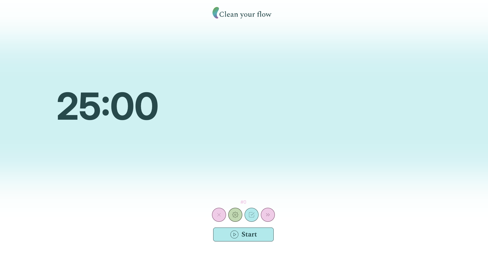

# Clean Your Flow - Pomodoro/Flowmodoro Timer


#### [🚀 Vai all'App](https://clean-your-flow.netlify.app)

## 📋 Descrizione

**Clean Your Flow** è un timer per la produttività che combina due tecniche di time management: la classica **Tecnica Pomodoro** e la **Tecnica Flowmodoro**. Il timer è stato progettato con una filosofia **"zero distrazioni"** per aiutare chi lo utilizza a mantenere il focus sui tuoi obiettivi e migliorare la sua produttività.

## ✨ Caratteristiche

### 🥫 Modalità Pomodoro

La tecnica classica: lavora per 25 minuti, pausa di 5 minuti. Dopo 4 cicli consecutivi, goditi una pausa lunga di 15-30 minuti.

### 🌸 Modalità Flowmodoro

Una tecnica più flessibile: lavora finché sei nel flusso, poi fai una pausa proporzionale al tempo di lavoro (es. 25 minuti di lavoro = 5 minuti di pausa).

### Funzionalità Principali

- ⏱️ Timer personalizzabile per entrambe le modalità
- 🎯 Sistema di gestione obiettivi per ogni sessione
- 🔔 Notifiche audio al termine di ogni fase
- 💾 Salvataggio automatico della sessione
- 🎨 Interfaccia pulita e minimale

## 🎬 Prova l'app

1. Naviga quì: [Clean your flow](https://clean-your-flow.netlify.app)
1. Imposta gli obiettivi che vuoi raggiungere durante la sessione
1. Imposta il tempo da dedicare alla sessione
1. Seleziona la modalità tra Pomodoro e Flowmodoro
1. Inizia a lavorare e mantieni il focus!

**Preview modalità Pomodoro:**



## 📦 Installazione

### Clone del Repository

```bash
git clone https://github.com/Giorgi0O/clean-your-flow.git
cd clean-your-flow
```

### Installazione Dipendenze

```bash
npm install
```

### Avvio in Locale

```bash
npm start
```

L'applicazione sarà disponibile su [http://localhost:3000](http://localhost:3000)

### Build per Produzione

```bash
npm run build
```

## 🛠️ Tecnologie Utilizzate

- **React.js**
- **Tailwind CSS**  

## 📁 Struttura del Progetto

```
clean-your-flow/
├── public/              
├── src/
│   ├── components/      
│   │   ├── page-flow-session/
│   │   ├── page-home/
│   │   └── shared/
│   ├── hooks/           
│   ├── pages/           
│   ├── utils/           
│   ├── App.js           
│   └── index.js         
├── package.json         
└── README.md            
```

### Cartelle Principali

- **`components/`** - Contiene tutti i componenti React dell'applicazione, organizzati per pagina
- **`pages/`** - Pagine principali come Home e Sessione Pomodoro/Flow
- **`hooks/`** - Custom hooks personalizzati per gestire timer e logica delle sessioni
- **`utils/`** - Funzioni di utilità e helper condivisi nell'applicazione

## 🤝 Contribuire

I contributi sono benvenuti! Se vuoi migliorare **Clean Your Flow**, segui questi passaggi:

1. Fai il fork del progetto
2. Crea un branch per la tua feature
   ```bash
   git switch -c feature/AmazingFeature
   ```
3. Commit delle modifiche
   ```bash
   git commit -m 'feat: add amazing feature'
   ```
4. Push sul branch
   ```bash
   git push origin feature/AmazingFeature
   ```
5. Apri una Pull Request

### 📋 Linee Guida per i Contributi

- Mantieni il codice pulito e leggibile
- Segui i pattern e le convenzioni esistenti nel progetto
- Testa accuratamente le modifiche prima del commit
- Rispetta la filosofia "zero distrazioni" del progetto

## 📄 Licenza

Questo progetto è distribuito sotto licenza MIT. Vedi il file `LICENSE` per maggiori dettagli.

## 👤 Autore

Creato con ❤️ da **Giorgio**

- GitHub: [@Giorgi0O](https://github.com/Giorgi0O)
- App Live: [clean-your-flow.netlify.app](https://clean-your-flow.netlify.app)

---

Spero che **Clean Your Flow** ti possa essere utile
